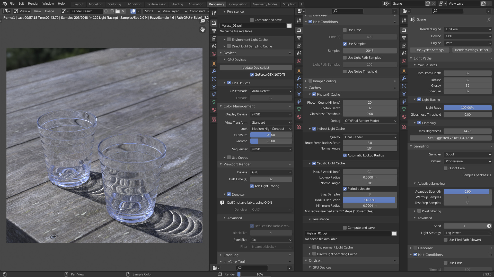
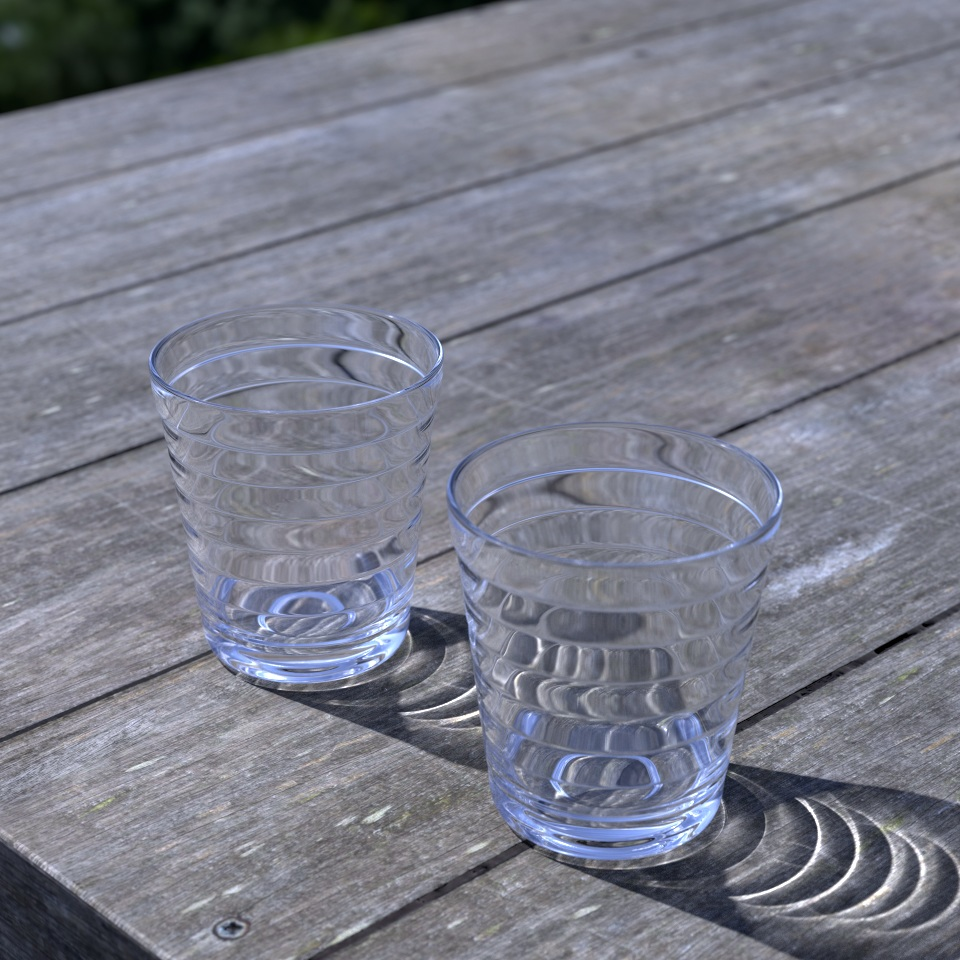

## How to use
1. Launch Blender (2.93 LTS)
2. Enable add-on (BlendLuxCore)
3. Open the file (b3d_luxcore_glass_test.blend)  
*If the GPU is not supported, the rendered image may become dark. In this case, please select CPU in Device.
## Blender version
[2.93.5](https://www.blender.org/download/releases/2-93/)
## Blender add-ons
[BlendLuxCore latest build](https://github.com/LuxCoreRender/BlendLuxCore/releases)  
(Build date used for rendering : 2021-11-15)
## HDRI & Texture
https://polyhaven.com/
## Rendering settings
  
## Rendering result
2048 samples  
  
8192 samples  
  
